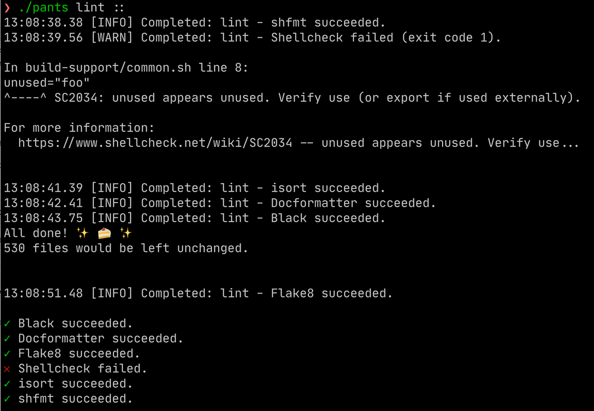

# Introducing Pants 2.5: Shell support, config autodiscovery, and incremental tool adoption

<CaptionedImg src={require("./splash.jpg").default}>
  Photo by [Giulia
  May](https://unsplash.com/@giuliamay?utm_source=ghost&utm_medium=referral&utm_campaign=api-credit)
  /
  [Unsplash](https://unsplash.com/?utm_source=ghost&utm_medium=referral&utm_campaign=api-credit)
</CaptionedImg>

{/* truncate */}

We're pleased to announce Pants 2.5.0, the latest release of Pants, the scalable and ergonomic build system.

To update, set `pants_version = "2.5.0"` in your `pants.toml`. See [upgrade tips](https://www.pantsbuild.org/docs/upgrade-tips).

## Shell support

Pants now supports Shell (e.g. Bash), in addition to Python!

Our goal is to empower you to follow best practices with your Shell scripts:

- [Shellcheck](https://www.shellcheck.net/): lint for common Shell mistakes.
- [shfmt](https://github.com/mvdan/sh): autoformat Shell code so that you can instead focus on the logic.
- [shUnit2](https://github.com/kward/shunit2/): write light-weight unit tests for your Shell code.

Pants installs these tools for you deterministically, and integrates them into the workflows you already use with Pants: `./pants lint`, `./pants fmt`, and `./pants test`.

Pants will run these tools concurrently with your Python builds. For example, you can lint your Shell scripts at the same time as linting your Python code (Flake8, Black, etc.), all with a single consistent interface: `./pants lint ::`.



See [https://www.pantsbuild.org/docs/shell](https://www.pantsbuild.org/docs/shell) for how to get started with Shell.

## Config autodiscovery

Pants will now autodiscover config files for the tools you run—like Black, isort, and Pytest—using the same semantics that the tools themselves use.

If your config file is in a non-standard location, you can still set options like `[black].config` and `[flake8].config` for Pants to tell the tools to load the config.

## Incremental tool adoption

You can now tell Pants to skip running a particular tool on specific files by updating the corresponding `BUILD` file.

```python title="helloworld/BUILD"
# Skip Black and Flake8 for all the non-test files in this folder.
python_library(skip_black=True, skip_flake8=True)

# Skip isort for all the test files in this folder.
python_tests(name="tests", skip_isort=True)
```

Pants will still run that tool on everything else, and will still run all your other tools on the skipped file.

This feature gives you a consistent mechanism to adopt tools like MyPy and Flake8 incrementally, regardless of how large your repository becomes.

<iframe
  width="100%"
  height="500"
  src="https://www.youtube.com/embed/BOhcdRsmv0s?si=Dl2IDI8QqJnGvQ9H"
  title="YouTube video player"
  frameborder="0"
  allow="accelerometer; autoplay; clipboard-write; encrypted-media; gyroscope; picture-in-picture; web-share"
  allowfullscreen
></iframe>

## Fine-grained resolves without a performance hit

Unlike most Python workflows (e.g. Poetry, Pipenv, `virtualenv`) that use a single virtual environment for the entire project, Pants understands your file's transitive dependencies and only uses what is actually needed for that file to run.

```shell-session
$ ./pants dependencies --transitive --type=3rdparty project/tests.py
ansicolors==1.1.8
typing-extensions==3.7.4.3
```

<figcaption>
  The `./pants dependencies` goal shows what exactly each file depends on. See
  https://www.pantsbuild.org/docs/project-introspection.
</figcaption>

Fine-grained resolves give you fine-grained caching, meaning that when you change your `requirements.txt`, for example, you only need to rerun tests whose requirements have changed, rather than needing to rerun your whole test suite. Fine-grained resolves also mean that Pants can [build artifacts like PEX files and wheels](https://www.pantsbuild.org/docs/python-package-goal) and use only that code's true dependencies, rather than the whole virtual environment.

However, these fine-grained resolves previously introduced a performance issue: resolving from PyPI and building wheels is extremely slow, and it's painful to do this for every permutation of your requirements used in the project. So, Pants had an option to use a single virtual environment, but you would lose the benefits of fine-grained resolves.

Now, Pants knows how to get the best of both worlds by resolving your dependencies only once, and then subsetting that resolve to extract only the requirements you actually need. If you use a global constraints file with `[python-setup].requirement_constraints`, Pants will first resolve all those dependencies once, downloading them and building their wheels. Then, Pants uses a new feature from PEX to extract the relevant subsets of that single resolve.

This change means that when you update your `requirements.txt` or `constraints.txt`, only the tests that actually use those requirements will be invalidated with Pants's cache—without needing to redownload and build wheels multiple times.

## Other changes

- Pants can now run with Python 3.9, in addition to 3.7 and 3.8. (Your own code can use a different Python version).
- Setting `[isort].config` will now tell isort to load the config file (when safe to do so), meaning that custom config file locations now work without needing to set `[isort].args`.
- `[coverage-py]` config files now work with `pyproject.toml`, `setup.cfg`, and `tox.ini`.
- `python_tests` targets have a new field `extra_env_vars` to augment the option `[test].extra_env_vars`.
- Added `RuleRunner.write_files()` for more declarative tests of Pants plugins.

See the full [changelog](https://github.com/pantsbuild/pants/blob/main/src/python/pants/notes/2.5.x.md) for more changes.

## Upcoming in Pants 2.6

We're re-envisioning Pants's support for Python third-party dependencies to be more ergonomic, flexible, and safe, including:

- Autogenerating lockfiles.
- Adding dedicated lockfiles for each tool you run, e.g. Black and Flake8.
- Supporting multiple lockfiles for your repository.
