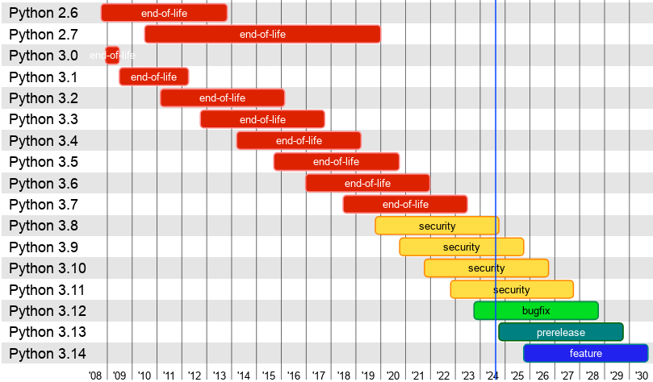

# Venerable Pythons, Pants, Pip, and Ecosystems

<CaptionedImg src={require("./splash.jpeg").default}>
  Photo by [David Clode](https://unsplash.com/@davidclode) /
  [Unsplash](https://unsplash.com/photos/python-resting-its-head-on-body-yrcaXCWe0VY)
</CaptionedImg>

{/* truncate */}

The Python development community concurrently supports multiple version of the Python programming language. These are in various states such as "prerelease", "bugfix", "security", or "end-of-life". For example version 3.12 is currently in "bugfix" while 3.8 is the oldest still receiving security updates. The cadence of future release is currently governed by [PEP 602 – Annual Release Cycle for Python](https://peps.python.org/pep-0602/)

Circa 2024 the state of [all Python versions](https://devguide.python.org/versions/) look something like:

That covers Python the _language_. The various projects and libraries that make up the broader Python ecosystem may support versions on different timetables. For example the `pip` project stopped supporting Python 3.7 in [2024-05](https://pip.pypa.io/en/stable/news/#b1-2024-05-06) which was significantly after Python 3.7 itself reached end-of-life in 2023. Other projects may hue closer to the "bleeding edge".

There are a few different "versions of Python" that are relevant for Pants:

- The versions of Python that Pants can test and build.
- The versions of Python that Pants supports "out of the box" with default tool lockfiles. This includes tools like `pip`, `black`, or `mypy`.
- The version of Python that Pants itself is written in. This is only relevant for plugin authors, the version that Pants itself uses is otherwise an [implementation detail](/blog/2023/02/23/the-pants-launcher-binary-a-much-simpler-way-to-install-and-run-pants)

Starting in Pants version 2.23, the default tool lockfile bundled with Pants will no longer support Python 3.7. Pants will still build and test Python 3.7 code! But you will first need to create your own [tool lockfiles](https://www.pantsbuild.org/2.21/docs/python/overview/lockfiles#lockfiles-for-tools).

This will allow the bundled lockfiles to support [versions of pip that will generate lockfiles faster](https://pip.pypa.io/en/stable/news/#v24-2), the [Python 3.13 release](https://github.com/pantsbuild/pants/issues/21103), and [more secure](https://github.com/pantsbuild/pants/issues/21184) versions of `setuptools`.

In the future as support across the Python ecosystem ebbs and flows, Pants will continue to adjust to provide broad "out of the box" support for a variety of Python versions.
